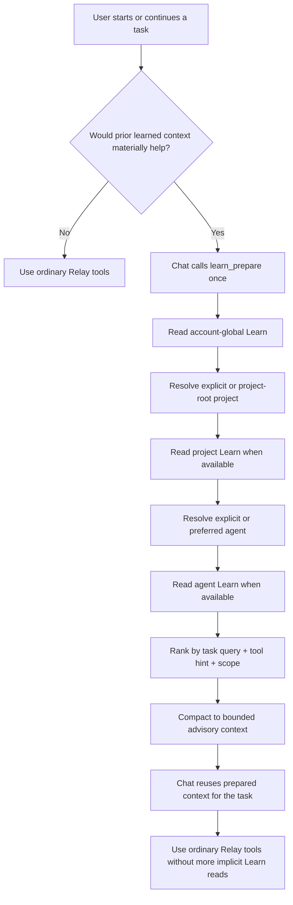

# Chat Relay

Remote MCP relay that lets ChatGPT work with a local Windows or macOS machine through a Cloudflare-hosted relay.

**Dashboard:** https://chat-relay.anusorn-hank.workers.dev/

**Release status:** v1.0 stable for internal use. Windows and macOS local agents are supported; Linux desktop control is not currently implemented. Post-1.0 fixes and operational hardening are shipped as normal patch releases.

## Quick start

There are two parts:

1. Connect ChatGPT to the relay.
2. Run the local agent on the computer you want ChatGPT to access.

### 1. Connect to ChatGPT

Add the production MCP server to ChatGPT:

```text
https://chat-relay.anusorn-hank.workers.dev/mcp
```

Complete the OAuth sign-in when ChatGPT opens the authorization flow.

ChatGPT MCP should connect to the plain `/mcp` endpoint. The legacy `/mcp?key=<USER_TOKEN>` flow remains available only during migration and should not be used for new connections.

ChatGPT connects to the cloud relay. To actually access files, terminal, processes, or desktop controls on a computer, that computer must also be running the local agent below.

### 2. Run the local agent with `npx`

Requirements: Node.js 20 or newer.

From any directory:

```bash
npx @anusornneal/chat-relay@latest remote
```

On the first run, Chat Relay opens browser-based device authorization. Choose **Continue with Google and authorize computer**, sign in with the same Google account used for the ChatGPT connector, then return to the terminal. Device sign-in requires configured Google OAuth and does not accept a local username/password.

The CLI saves the device credentials in your user profile using Windows DPAPI or macOS Keychain when available (with a permission-restricted file fallback), so later you can reconnect with the same command:

```bash
npx @anusornneal/chat-relay@latest remote
```

Enable desktop screenshot, mouse, and keyboard access:

```bash
npx @anusornneal/chat-relay@latest remote --desktop
```

Limit filesystem access to a specific root:

```bash
npx @anusornneal/chat-relay@latest remote --root "C:\Users\you\Projects"
```

## `npx` commands

| Command | What it does |
| --- | --- |
| `npx @anusornneal/chat-relay@latest remote` | Connects this computer to Chat Relay and keeps the local agent running. Enables the capabilities allowed for this device, such as files, terminal, and processes. |
| `npx @anusornneal/chat-relay@latest remote --desktop` | Starts the agent with desktop screenshot/input support enabled. Desktop permissions must also be granted by the relay. |
| `npx @anusornneal/chat-relay@latest login` | Signs in and registers this computer without starting the long-running agent. |
| `npx @anusornneal/chat-relay@latest login --force` | Forces a fresh sign-in and device authorization. Useful when credentials were revoked or need to be replaced. |
| `npx @anusornneal/chat-relay@latest status` | Shows the signed-in account, device, relay URL, online state, scopes, agent version, protocol compatibility, lifecycle state, allowed roots, and desktop state. |
| `npx @anusornneal/chat-relay@latest drain` | Stops accepting new long-running work so active work can finish before a restart. |
| `npx @anusornneal/chat-relay@latest resume` | Cancels drain mode and resumes normal work admission. |
| `npx @anusornneal/chat-relay@latest restart` | Restarts the local agent after drain has completed and the agent is ready to restart. |
| `npx @anusornneal/chat-relay@latest upgrade` | After drain has completed, hands off the local agent to `@anusornneal/chat-relay@latest` and reconnects with the saved configuration. |
| `npx @anusornneal/chat-relay@latest logout` | Revokes this computer login and removes its local credentials. |
| `npx @anusornneal/chat-relay@latest help` | Shows CLI usage and available options. |

Useful options:

```text
--root <path>       Allowed filesystem root. Use semicolons for multiple roots.
--name <name>       Computer display name.
--agent-id <id>     Stable agent identifier.
--desktop           Enable desktop access.
--no-desktop        Disable desktop access.
--no-open           Do not open the login browser automatically.
--force             Force a new login.
--relay <url>       Use another Chat Relay deployment.
```

## What ChatGPT can access

Depending on the device grants and local configuration, Chat Relay can expose:

- Filesystem operations inside configured allowed roots.
- Terminal commands and persistent terminal sessions. Short stateless commands automatically reuse a cross-platform shell pool; stateful commands fall back to isolated execution.
- Process inspection and termination.
- Windows/macOS screenshots, mouse input, and keyboard input when desktop access is explicitly enabled.
- Multiple computers under one account, with per-device routing and permissions.
- Agent lifecycle control from ChatGPT with process permission: inspect status, drain/resume, restart, and safely hand off to the latest published package.
- Batched filesystem, terminal, and desktop operations to reduce remote round trips.

Desktop access is opt-in. Linux desktop control is not currently implemented.

## How it works

```text
ChatGPT
   |
   | Streamable HTTP MCP + OAuth
   v
Cloudflare Worker
   |
   +-- Registry Durable Object
   |
   +-- Relay Durable Object
           |
           | WebSocket
           v
      Local Agent
      - files
      - terminal
      - processes
      - desktop
```

ChatGPT talks only to the cloud MCP endpoint. The local computer opens the outbound WebSocket connection to the relay.

## Security model

- ChatGPT MCP authentication uses OAuth 2.1 authorization code flow with PKCE.
- Local computers use browser/device authorization; raw agent tokens do not need to be copied manually.
- Filesystem access is constrained to configured allowed roots.
- Access is scope-based: read, write, terminal, process, desktop read, and desktop control can be granted separately.
- Desktop access is disabled by default.
- Stored credentials are hashed server-side where applicable.
- Local user and agent tokens are kept outside `config.json`; Windows uses user-bound DPAPI and macOS uses Keychain when available.
- Persisted usage/audit telemetry is metadata-only and excludes commands, file contents, screenshots, clipboard contents, and credentials.

Chat Relay is currently intended for small trusted teams rather than an enterprise zero-trust control plane.

## Local configuration

Default CLI config locations:

- Windows: `%LOCALAPPDATA%\chat-relay\config.json`
- macOS/Linux: `$XDG_CONFIG_HOME/chat-relay/config.json` or `~/.config/chat-relay/config.json`

Set `CHAT_RELAY_HOME` to override the config directory. `config.json` stores non-secret settings plus the credential storage type; authentication tokens are stored separately. Linux and CI environments use a mode-`0600` secret-file fallback unless another store is explicitly selected.

A single account can own multiple computers. Each computer keeps its own agent identity and credential.

## Development

Clone the repository only when developing Chat Relay itself. Normal users should use the zero-checkout `npx` flow above.

Common development commands:

```bash
npm install
npm start
npm run dev
npm run test:hardening
npm run test:soak
npm run verify:publish
```

The default soak test runs 2,000 deterministic reconnect/telemetry/TUI iterations without a live cloud relay. For a longer local run:

```bash
CHAT_RELAY_SOAK_ITERATIONS=100000 npm run test:soak
```

PowerShell:

```powershell
$env:CHAT_RELAY_SOAK_ITERATIONS=100000; npm run test:soak
```

`npm run verify:publish` checks the publish file set, CLI entrypoint, Worker dry-run build, review artifacts, and production dependency audit.

## Administration

Administration is separate from the public MCP interface. The admin tooling manages users, agents, grants, lifecycle, audit data, and operational cleanup.

Operator commands are available through:

```bash
npm run admin -- <command>
```

Keep `ADMIN_TOKEN` and other deployment secrets out of client configuration and source control.

Optional Cloudflare-pressure circuit breakers can be configured with `USAGE_RECORD_DAILY_BUDGET` (skip optional usage-record DO calls after the per-isolate budget) and `USAGE_DASHBOARD_PUBLISH_DAILY_BUDGET` (cap optional dashboard publish calls from the Usage Durable Object). Both default to disabled and are safeguards, not exact Cloudflare billing meters. The local TUI health monitor also backs off automatically after Cloudflare 1027/429/resource errors.

## Platform notes

- Local agent: Windows and macOS.
- Desktop control: Windows and macOS.
- Linux desktop control: not implemented.
- MCP transport: Streamable HTTP over HTTPS.
- Local agent transport: outbound WebSocket.
- Node.js: 20+.

## More information

- Public plugin/reviewer flow: `docs/plugin-review.md`
- Google sign-in setup: `docs/google-login.md`
- Source: https://github.com/anusornNeal/chat-relay


## Account-scoped Learn

Chat Relay can persist small, structured pieces of execution context per authenticated account. Learn is **not model training** and it does not capture conversations or ordinary tool payloads automatically.

The MCP surface is:

- `learn_prepare` performs one explicit, relevance-aware preparation pass for the current task. It can combine global, project, and agent memories, then rank and compact them into one advisory context envelope.
- `learn_get` reads raw memories for selected scopes when targeted inspection is needed.
- `learn_put` creates or updates one durable memory when Chat decides a reusable signal is worth keeping.
- `learn_delete` removes one memory.
- `learn_feedback` records positive or negative feedback on one memory.

Memories are partitioned by authenticated account using a dedicated Learning Durable Object selected from the server-side `user.id`. Callers cannot provide or override an account id. Supported scopes are `global`, `project`, and `agent`; project and agent memories require a scope key.

Learn remains intentionally lightweight: there are no embeddings, vector database, local LLM, transcript ingestion, or per-tool-call Learn reads/writes. A normal Relay tool call does **not** touch the Learning Durable Object. Storage changes happen only when an explicit Learn mutation is requested. Each account is capped at 512 memories, each memory content field is capped at 4,000 characters, and raw reads return at most 100 records. Do not store credentials, tokens, secrets, raw tool payloads, terminal output, file contents, or screenshots in Learn.

## Explicit one-shot Learn preparation

Chat decides whether learned context is useful for the task. When it is, Chat calls `learn_prepare` once and reuses the returned context for the rest of that task instead of re-preparing before every tool call.



The decision boundary is deliberate:

- **Chat decides semantic Learn use:** whether to prepare context, whether a correction/preference/workflow is durable enough to learn, and when a targeted raw `learn_get` is needed.
- **Reusable user corrections are active-learning signals by default:** when a user directly corrects a reusable mistake in workflow, tool usage, coding conventions, or response behavior, Chat should call `learn_put` in the same turn without waiting for an explicit "learn". Use global scope for cross-project behavior, project scope for project-specific behavior, and skip one-off situational details.
- **Relay performs mechanical preparation only after `learn_prepare` is explicitly called:** account isolation, project routing from explicit `project-root:<projectKey>` memories or explicit `projectKey`, preferred-agent routing, bounded reads, relevance ranking, and compaction.
- **Ordinary tools stay hot-path clean:** `ping_agent`, file tools, terminal tools, desktop tools, and other MCP calls do not automatically read, rank, inject, or write Learn.
- Learned hints remain advisory and never override authorization, grants, allowed roots, destructive-tool policy, capability checks, safety, or the current user request.

Routing hints are explicit memories. A global `project_context` memory with key `project-root:<projectKey>` stores the concrete project root. A `preferred-agent` memory may exist in project scope (preferred) or global scope (fallback). `learn_prepare` can also take explicit `projectKey` and `agentId` values when Chat already knows them.

`learn_prepare` is intentionally one-shot and stateless at the Worker level. There is no warm session cache or durable Learn session state to maintain. This prevents Learn from becoming an implicit per-tool CPU/subrequest tax while still allowing relevance-aware context preparation when it is actually useful.
